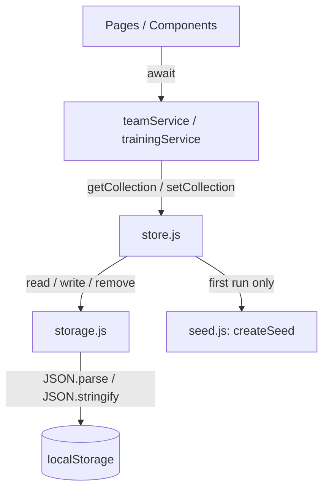

# Persistence Layer Design

**Spec**: `.specs/features/01-persistence-layer/spec.md`
**Status**: Approved — proceeding to Execute

---

## Approach Exploration (Design Notes Q1, Q2, Q4)

Two viable shapes for the store core:

**A — Read-through cache.** `store.js` parses each collection from `localStorage`
once, holds it in memory, serves subsequent reads from that cache, and
invalidates the relevant entry on every write. Avoids repeated `JSON.parse`
calls (`pages/Trainings.jsx` currently calls `getAll()` up to three times on
mount).

**B — No cache; parse fresh on every read.** `store.getCollection()` always goes
through `storage.read()`, which does a real `JSON.parse` per call. AD-004's copy
semantics ("two reads return non-reference-identical objects") fall out for
free — a fresh `JSON.parse` is, by construction, a fresh object graph unconnected
to anything previously returned. No invalidation logic exists because there is
nothing to invalidate.

**Recommendation: B.** The dataset here is a handful of teams/trainings —
kilobytes, not megabytes — so the perf cost of re-parsing is sub-millisecond and
unmeasurable in this app. Option A buys nothing at this scale and imports a real
risk: cache/store divergence bugs (the exact class of bug this feature exists to
eliminate — see the Problem Statement's "in-place mutation" defect). Option B
also removes `structuredClone` from the design entirely (Q2) — no need to
special-case its availability under jsdom, because nothing needs cloning; a
fresh `JSON.parse` already produces disconnected data. If reads ever show up in
profiling, add caching then, scoped to the collection that needs it.

This also settles **Q1 (store shape)**: per-collection keys
(`coachplanner:v1:teams`, `coachplanner:v1:trainings`, …), matching the
Assumption already logged in `spec.md`. A single document key would force every
read to parse every collection, which cuts against the no-cache decision above —
per-collection keys let each `getCollection(name)` touch only its own key.

**Q5 (player id uniqueness)** resolves itself: `crypto.randomUUID()` (AD-003) has
no scoping concept, so global uniqueness across all teams is automatic — no
dedup logic needed.

**Q3 (date field registry)** — see Data Models below; it's a plain object map in
`store.js`, extended by adding one key per future collection.

---

## Architecture Overview



Four layers, same shape as the existing codebase's layering
(`docs/03-architecture.md`), with one new layer inserted between services and
`localStorage`:

- **Services** (`teamService.js`, `trainingService.js`) — unchanged public API,
  now backed by the store instead of mutating module-level arrays.
- **Store** (`store.js`, new) — the repository: seed-on-first-run, per-collection
  get/set, schema version, reset. Domain-aware (knows collection names and which
  fields are dates).
- **Storage** (`storage.js`, new) — a generic, domain-*unaware* key/value
  primitive over `localStorage`: JSON read/write/remove, date revival by field
  name, quota and unavailability handling. Doesn't know what a "team" is.
- **Seed** (`seed.js`, new, replaces `mock.js`) — a factory returning fresh seed
  data, called once by the store on first run.

---

## Code Reuse Analysis

### Existing Components to Leverage

| Component | Location | How to Use |
|---|---|---|
| `teamService` / `trainingService` public API | `src/services/*.js` | Method signatures unchanged — internals rewritten to call `store` instead of mutating `src/model/mock.js` arrays |
| `ConfirmationPopup` | `src/components/ConfirmationPopup.jsx` | Reused as-is for the reset-demo-data confirmation (T10) |
| `loadTeams()` pattern | `src/pages/Teams.jsx` | Extended (not replaced) — becomes the base for the `refreshAndResync` helper below |
| Seed data values | `src/model/mock.js` | Same records, same ids, moved into `createSeed()` — not regenerated |

### Integration Points

| System | Integration Method |
|---|---|
| `localStorage` | `storage.js` is the only module that touches it directly |
| `AuthContext` | Untouched — its `user` key lives outside the `coachplanner:v1:*` namespace, so `store.reset()` never collides with it (AC PERSIST-06.3) |

---

## Components

### `src/lib/storage.js` (new)

- **Purpose**: Generic namespaced JSON key/value storage with date revival and
  failure handling. Has no knowledge of teams, players, or trainings.
- **Interfaces**:
  - `read(key, dateFields = [])` → parsed value or `null` if absent/corrupt. If
    the parsed value is an array and `dateFields` is non-empty, each listed
    field on each element is revived from an ISO string to a `Date`.
  - `write(key, value)` → serializes with `JSON.stringify` (which already turns
    `Date` instances into ISO strings via `Date.prototype.toJSON`) and stores
    under `coachplanner:v1:<key>`. Throws `StorageQuotaError` on quota failure.
  - `remove(key)` → deletes the namespaced key. (Added beyond T1's original
    listed scope — needed by `store.reset()` in T4; see Tech Decisions.)
- **Dependencies**: `localStorage`, with an in-memory `Map` fallback chosen once
  per session (probed via a `try`/`catch` `setItem`/`removeItem` at first use)
  when `localStorage` throws or is unavailable — warns once via `console.warn`.
- **Reuses**: nothing (new primitive).

**Note on scope vs. `tasks.md`:** `read`/`dateFields` here works on *any* JSON
value, not only arrays of records — this is what lets `store.js` use the same
primitive for the scalar schema-version marker (see below) without a second
storage mechanism. Arrays of records (the only shape `tasks.md` describes) work
exactly as T1 specifies; this is a widening, not a behavior change for the
documented case.

### `src/lib/id.js` (new)

- **Purpose**: Collision-free id generation (AD-003).
- **Interfaces**: `newId()` → `string`, via `crypto.randomUUID()` or a
  timestamp+counter fallback.
- **Dependencies**: `crypto.randomUUID` (optional).
- **Reuses**: nothing.

### `src/lib/errors.js` (new — not named in any task's file list; created during T5, the first consumer)

- **Purpose**: One shared typed error for "no record with this id" — replaces
  services throwing a bare `TypeError` on an unfound record.
- **Interfaces**: `class NotFoundError extends Error { constructor(message) }`.
- **Reuses**: nothing. Used by `teamService` (T5, T6) and `trainingService`
  (T7) — created once, imported by both.

### `src/model/seed.js` (new, replaces `src/model/mock.js`)

- **Purpose**: Factory for fresh seed data — same records as today's
  `mock.js`, same ids, but a new object graph on every call so the store never
  hands out a reference to a cached seed.
- **Interfaces**: `createSeed()` → `{ teams: Team[], trainings: Training[] }`.
  `Positions` is exported (currently private in `mock.js`).
- **Reuses**: the existing seed values verbatim.

### `src/services/store.js` (new)

- **Purpose**: The repository — seed-on-first-run, per-collection read/write,
  schema versioning, reset.
- **Interfaces**:
  - `getCollection(name)` → array, always freshly parsed (see Approach
    Exploration — this is what gives copy semantics for free).
  - `setCollection(name, value)` → persists.
  - `reset()` → removes all known collections + the schema-version key, then
    re-seeds immediately (so the app is never left with an empty store).
- **Dependencies**: `storage.js`, `seed.js`.
- **Reuses**: nothing else.

**Internal shape:**

```js
const SCHEMA_KEY = "schemaVersion";
const SCHEMA_VERSION = 1;
const DATE_FIELDS = { teams: [], trainings: ["day"] }; // extend here for games/ratings later
const COLLECTION_NAMES = Object.keys(DATE_FIELDS);
const MIGRATIONS = {}; // e.g. { 2: (data) => ... } — empty until a v2 ever exists

function ensureSeeded() {
  if (storage.read(SCHEMA_KEY) !== null) return; // AC PERSIST-01.5
  const seed = createSeed();
  for (const name of COLLECTION_NAMES) storage.write(name, seed[name]);
  storage.write(SCHEMA_KEY, SCHEMA_VERSION);
}
```

The "identity migration hook" T4 asks for is this `MIGRATIONS` registry plus a
runner that walks it — empty today (nothing to migrate from, v1 is the first
version), but real, present, and testable (asserting it's a no-op at v1) rather
than a comment.

### Task-scope corrections (identified during Design, not in `tasks.md`'s original `Where` fields)

`spec.md`'s own Success Criteria states *"Zero `Math.random()` id generation
remains in the codebase."* Three UI components still generate their own client
ids today (`TeamPopup.jsx`, `PlayerPopup.jsx`, `TrainingSavePopup.jsx`) and none
of T5–T8's `Where` fields name them. Since every service `create()` method now
assigns its own id via `newId()` regardless of what the caller sends, these
components' generated ids become dead values the moment the service migration
lands — leaving the `Math.random()` calls in place would silently violate the
feature's own stated success criterion. Folding the fix into the task that
changes the corresponding service's contract keeps each change atomic:

| Task | Additional file | Change |
|---|---|---|
| T5 | `src/components/TeamPopup.jsx` | Drop the `Math.floor(Math.random() * 100)` fallback for the create-mode id; edit mode keeps `team.id` (still needed — `update()` looks records up by id) |
| T6 | `src/components/PlayerPopup.jsx` | Same pattern for player ids |
| T7 | `src/components/TrainingSavePopup.jsx` | Same pattern for the **top-level training id only**. The exercise-array's `Date.now()` ids are left untouched — `04-training-form` fully rewrites that exercise-capture code path; touching it here would conflict with that later rewrite for no benefit now |

Separately, re-reading `TeamCard.jsx` and `PlayerCard.jsx` during design turned
up a bug `spec.md` under-described: **editing** a team or player doesn't
refresh the parent list either — only *deleting* does, because the edit-mode
popup's `onClose` only flips a local `showEdit` boolean; it never reaches the
`onClose` prop the parent uses to trigger `loadTeams()`. `PERSIST-04` ("UI
refresh after mutation") covers this by AC intent even though the two example
ACs given (add player, create training) don't name it explicitly.

| Task | Additional file | Change |
|---|---|---|
| T8 | `src/components/TeamCard.jsx` | Add an `onUpdated` prop, called after a confirmed edit-save (distinct from `onClose`, which stays delete-only) |
| T8 | `src/components/PlayerCard.jsx` | Same pattern |

This distinction matters: reusing `onClose` for both would clear the current
selection after every edit, which is worse UX than today's (currently-broken
but at least non-disruptive) behavior — T8's own Done-when is explicit that only
*delete* should clear the selection.

**`Teams.jsx` refresh helper** (new internal function, not a new file):

```js
const loadTeams = async () => {
  const data = await teamService.getAll();
  setTeams(data);
  return data;
};

const refreshAndResync = async () => {
  const data = await loadTeams();
  setSelectedTeam((prev) => (prev ? data.find((t) => t.id === prev.id) ?? null : prev));
};
```

Used by: the create-team popup's `onClose`, the create-player popup's
`onClose`, `TeamCard`'s new `onUpdated`, and (one level deeper, re-resolving
`selectedPlayer` from the refreshed team's `players`) `PlayerCard`'s new
`onUpdated`. `closeTeam()` (delete path) is unchanged — it already clears the
selection and reloads.

---

## Data Models

```typescript
// storage.js — generic, no domain types

// store.js
interface DateFieldRegistry {
  [collectionName: string]: string[]; // field names to revive as Date on read
}

// Concrete registry for this feature:
const DATE_FIELDS = {
  teams: [],
  trainings: ["day"],
};
```

No shape changes to `Team`, `Player`, or `Training` themselves — see
`docs/04-data-model.md`. The only structural change is that `id` fields are now
opaque UUID strings rather than small integers or `Math.random()` output.

**Relationships**: unchanged — `Player` nests inside `Team.players`;
`Training.teamId` references `Team.id`.

---

## Error Handling Strategy

| Error Scenario | Handling | User Impact |
|---|---|---|
| Unknown id passed to `update`/`addPlayer`/etc. | Throw `NotFoundError` (typed, from `src/lib/errors.js`) instead of a bare `TypeError` on `undefined` | Same as today — popups have no submit-time try/catch (pre-existing, documented gap, **not** in scope here; see below) |
| `localStorage.setItem` throws a quota error | `storage.write` catches it and re-throws `StorageQuotaError` (carries the collection name) | None yet — no UI consumes it in this feature; the typed error exists so a future task *can* display one, per the spec's edge case wording ("SHALL throw a typed error the caller can display" — the capability is the requirement, not that every call site uses it today) |
| `localStorage` unavailable (private mode, disabled) | `storage.js` falls back to an in-memory `Map` for the session, warns once via `console.warn` | Data doesn't survive reload in that mode — acceptable per spec (fallback exists so the app doesn't crash, not so it persists) |
| Corrupt JSON in a stored key | `storage.read` returns `null` (same signal as "absent") and logs one warning; `store.ensureSeeded` treats it as first-run and re-seeds | User sees the seed data reappear, with a console warning — never a crash |
| Two tabs write concurrently | Not handled — last write wins, documented limitation (AD/spec edge case) | Silent overwrite; out of scope to prevent |

**Deliberately not adding**: try/catch around every popup's submit handler.
`docs/05-services.md` already documents that mutation call sites (as opposed to
the read-side `loadTeams()`-style calls) have no error handling today. This
feature makes errors *typed and throwable*; wiring every submit handler to
catch and display them is a UI-polish feature of its own, not implied by any AC
here, and adding it now would be scope beyond what's asked.

---

## Risks & Concerns

| Concern | Location | Impact | Mitigation |
|---|---|---|---|
| jsdom's quota-exceeded behavior is unverified | `src/lib/storage.js` (T1, new) | If jsdom doesn't throw a `QuotaExceededError`-shaped error the way real browsers do, T1's quota test could pass against a mock that doesn't match real behavior | Verify empirically while writing T1's test — write until quota triggers, inspect the real thrown error's `.name`, and match against that rather than assuming a name |
| `TeamCard`/`PlayerCard` prop surface grows (`onUpdated`) | `src/components/TeamCard.jsx`, `PlayerCard.jsx` | Slightly larger public component API | Scoped narrowly — one new callback each, both already documented above with an explicit reason tied to an AC |
| `pages/Settings.jsx` is currently a bare placeholder | `src/pages/Settings.jsx` | T10 is the first real content this file gets | No mitigation needed — this is expected, not a regression |

> No security, N+1, or systemic performance concerns found — this is a local,
> single-user, kilobyte-scale data layer.

---

## Tech Decisions

| Decision | Choice | Rationale |
|---|---|---|
| Caching | None — parse fresh on every `getCollection` call | See Approach Exploration. Removes an entire bug class (cache/store divergence) for negligible cost at this data scale |
| `storage.read`'s value shape | Generic (any JSON value), not array-only | Lets the scalar schema-version marker reuse the same read/write primitive as collections, avoiding a second storage mechanism |
| Quota/corruption handling | `storage.read` returns `null` uniformly for "absent" and "corrupt"; `storage.write` throws a typed error only on quota failure | Read failures are recoverable (re-seed); write failures must be visible to the caller, not silently swallowed |
| `NotFoundError` location | `src/lib/errors.js`, created during T5 | Shared by `teamService` and `trainingService`; not worth a dedicated Phase-1 task for one class |
| `Math.random()` cleanup in popups | Bundled into the task that changes the corresponding service's `create()` contract (T5/T6/T7), not a separate task | Keeps "id ownership moves to the service" atomic per entity type |
| `onUpdated` prop on `TeamCard`/`PlayerCard` | Bundled into T8 | It's a refresh-after-mutation concern, matching T8's own purpose, not the service-migration tasks |

None of the above rise to project-level (`STATE.md` `## Decisions`) — they're
implementation choices local to this feature, consistent with and elaborating
on the already-active AD-002/AD-003/AD-004.

---

## Tips followed

- Confirmed the recommended approach's rationale explicitly (Approach
  Exploration) rather than silently picking one.
- Reused the existing `ConfirmationPopup` and `loadTeams` patterns rather than
  inventing new ones.
- Flagged every concern found while reading the affected files, each with a
  mitigation.
- Task-scope corrections are listed by task, not left implicit — `tasks.md`
  itself is not rewritten; these notes are what Execute follows when a task's
  literal `Where` field turns out to be incomplete.
