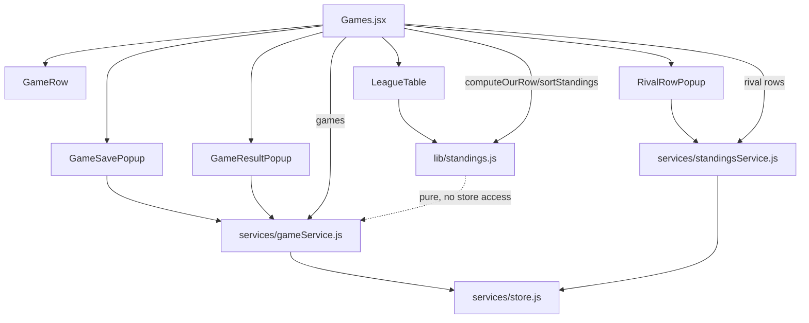

# Games & League Table Design

**Spec**: `.specs/features/07-games-league-table/spec.md`
**Status**: Approved

---

## Architecture Overview

Follows the existing layered pattern unchanged (`docs/03-architecture.md`): pages
own data-fetching and modal state, components are presentational, services are
the only modules touching the store. Two new entities are added — `games`
(top-level, mirrors `trainings`) and `standings` (rival rows only; our row is
never persisted).



`lib/standings.js` is pure — it takes games/rows as arguments and returns
computed data. It never imports a service, matching `lib/trainingNumber.js`.

---

## Code Reuse Analysis

### Existing Components to Leverage

| Component | Location | How to Use |
|---|---|---|
| `*Popup` overlay shell | `src/components/TrainingSavePopup.jsx`, `ConfirmationPopup.jsx` | Same fixed-overlay + white card markup for `GameSavePopup`, `GameResultPopup`, `RivalRowPopup` |
| `toInputValue` / `fromInputValue` | `src/lib/datetime.js` (feature 06) | `GameSavePopup`'s date/time field, same round-trip approach as `TrainingSavePopup` |
| Team `<select>` + validation pattern | `src/components/TrainingSavePopup.jsx` (feature 03/04) | "No team chosen blocks submission" — same shape in `GameSavePopup` |
| Filter-list + two-bucket layout | `src/pages/Trainings.jsx` | Duplicated (not extracted) into `Games.jsx` — see Tech Decisions |
| `SelectableListItem` | `src/components/SelectableListItem.jsx` | Team filter list on the Games page, identical usage to `Trainings.jsx` |
| Collection registration pattern | `src/services/store.js`, `src/model/seed.js` | Adding `games` and `standings` follows the same `DATE_FIELDS` / `COLLECTION_NAMES` shape used for `trainings` |
| `newId()`, `NotFoundError` | `src/lib/id.js`, `src/lib/errors.js` | Every new service reuses these unchanged |
| `getUnassigned()` pattern | `src/services/trainingService.js` | `gameService.getUnassigned()` mirrors it exactly (dangling/null `teamId`) |

### Integration Points

| System | Integration Method |
|---|---|
| `services/store.js` | Two new collection names added to `COLLECTION_NAMES` / `DATE_FIELDS`: `games` (date field `date`), `standings` (no date fields) |
| `App.jsx` / `Sidebar.jsx` | No change — `/games` route already exists and renders the placeholder `pages/Games.jsx`, which this feature replaces |

---

## Components

### `gameService`

- **Purpose**: CRUD over the `games` collection, plus result recording/clearing and the scheduled/played split.
- **Location**: `src/services/gameService.js`
- **Interfaces**:
  - `getAll(teamId?): Promise<Game[]>` — all games, optionally filtered by team
  - `getScheduled(teamId?): Promise<Game[]>` — `hasResult(game) === false`
  - `getPlayed(teamId?): Promise<Game[]>` — `hasResult(game) === true`
  - `getUnassigned(): Promise<Game[]>` — `teamId` null or matching no team
  - `create(gameData): Promise<Game>` — assigns `newId()`, forces `usScore`/`themScore` to `null`
  - `update(gameData): Promise<Game>` — throws `NotFoundError` on unknown id
  - `delete(id): Promise<void>`
  - `recordResult(id, { us, them }): Promise<Game>` — sets both scores
  - `clearResult(id): Promise<Game>` — sets both scores back to `null`
- **Dependencies**: `services/store.js`, `lib/id.js`, `lib/errors.js`, `lib/gameResult.js` (see below)
- **Reuses**: The exact method shape and copy-on-read discipline (AD-004) of `trainingService.js`

### `lib/gameResult.js` (new — the null-vs-zero guard)

- **Purpose**: One place that answers "has a result?" and "what's the outcome?" so the flat-field representation (`usScore`/`themScore`) can never be checked inconsistently across the service, `GameRow`, and standings.
- **Location**: `src/lib/gameResult.js`
- **Interfaces**:
  - `hasResult(game): boolean` — `true` iff **both** `usScore` and `themScore` are not `null`/`undefined`. `0`–`0` → `true`.
  - `deriveOutcome(game): "win" | "draw" | "loss" | null` — `null` when `hasResult(game)` is `false`; otherwise compares `usScore` to `themScore`. Never stored on the record (AC GAME-06.3).
- **Dependencies**: none (pure)
- **Reuses**: nothing — this is the one truly new piece of logic the flat-field choice requires

**Why this exists:** the flat-field option was chosen over nesting `result: {us, them} | null` for simpler form binding. That trades away the "single null check" property nested would have given for free — `hasResult`/`deriveOutcome` restore it as two centralized functions instead of ad-hoc `!= null` checks scattered across the service, the row, and standings. Every "has a result" or "what's the outcome" check in this feature MUST go through these two functions — never inline `game.usScore != null` elsewhere.

### `GameSavePopup`

- **Purpose**: Create/edit popup for a fixture (team, opponent, date/time, home/away, competition).
- **Location**: `src/components/GameSavePopup.jsx`
- **Interfaces**: `<GameSavePopup game?={Game} teamId?={id} onClose={fn} onSubmit={fn}>` — same `training`/`onSubmit` prop shape as `TrainingSavePopup` (feature 06)
- **Dependencies**: `teamService.getAll`, `lib/datetime.js`
- **Reuses**: `TrainingSavePopup`'s team-select markup, validation-message pattern, and edit-mode prop convention (optional entity prop pre-fills; caller decides create vs. update via `onSubmit`)

### `GameRow`

- **Purpose**: Renders one fixture — opponent, date, home/away, and (if played) the scoreline and derived outcome.
- **Location**: `src/components/GameRow.jsx`
- **Interfaces**: `<GameRow game={Game} onSelect={fn}>`
- **Dependencies**: `lib/gameResult.js` (`hasResult`, `deriveOutcome`)
- **Reuses**: `SelectableListItem`-style row markup and the `formatDay`/"Invalid date" fallback pattern from `pages/Trainings.jsx`

### `GameResultPopup`

- **Purpose**: Record, edit or clear a game's scoreline.
- **Location**: `src/components/GameResultPopup.jsx`
- **Interfaces**: `<GameResultPopup game={Game} onClose={fn} onSubmit={fn} onClear={fn}>`
- **Dependencies**: none directly (page wires `gameService.recordResult`/`clearResult` through the callbacks, same indirection `TrainingSavePopup` uses for `trainingService`)
- **Reuses**: `*Popup` overlay shell; validation-message pattern

### `lib/standings.js`

- **Purpose**: Pure functions turning played games into our standings row, and sorting all rows.
- **Location**: `src/lib/standings.js`
- **Interfaces**:
  - `computeOurRow(games, teamName): StandingsRow` — filters to `hasResult(g)`, folds into played/won/drawn/lost/goalsFor/goalsAgainst; `goalDifference` and `points` always derived, never read from input
  - `sortStandings(rows): StandingsRow[]` — stable sort by points desc, then goalDifference desc, then goalsFor desc, then name asc (deterministic tiebreak); does not mutate input (AD-004)
- **Dependencies**: `lib/gameResult.js`
- **Reuses**: nothing — new pure logic, modeled after `lib/trainingNumber.js`'s "pure function, returns new array" shape

### `LeagueTable`

- **Purpose**: Renders sorted standings rows with our row highlighted and numbered.
- **Location**: `src/components/LeagueTable.jsx`
- **Interfaces**: `<LeagueTable rows={StandingsRow[]} ourRowId={sentinel}>` — the page passes already-sorted rows; the component does not call `sortStandings` itself
- **Dependencies**: none (presentational)
- **Reuses**: Tailwind table styling per AD-005; horizontal-scroll wrapper pattern already used for `TrainingSavePopup`'s exercise list (`overflow-y-auto` → here `overflow-x-auto`)

### `standingsService`

- **Purpose**: CRUD over the `standings` collection — **rival rows only**. Our row is never written here.
- **Location**: `src/services/standingsService.js`
- **Interfaces**:
  - `getAll(): Promise<RivalRow[]>`
  - `create(rowData): Promise<RivalRow>` — validates `won + drawn + lost === played` and no negative figures before assigning `newId()`; throws `ValidationError` (new, see below) on failure
  - `update(rowData): Promise<RivalRow>` — same validation; throws `NotFoundError` on unknown id
  - `delete(id): Promise<void>`
- **Dependencies**: `services/store.js`, `lib/id.js`, `lib/errors.js`
- **Reuses**: `trainingService`/`teamService`'s CRUD shape

### `RivalRowPopup`

- **Purpose**: Create/edit popup for a manually-entered rival standings row.
- **Location**: `src/components/RivalRowPopup.jsx`
- **Interfaces**: `<RivalRowPopup row?={RivalRow} onClose={fn} onSubmit={fn}>`
- **Dependencies**: none directly — validation lives in `standingsService`, popup surfaces the thrown message
- **Reuses**: `*Popup` overlay shell, edit-mode prop convention

---

## Data Models

### Game

```typescript
interface Game {
  id: string;           // newId()
  teamId: number | string | null;
  opponent: string;
  date: Date;            // registered as a date field in store.js, like Training.day
  isHome: boolean;
  competition: string;   // free text — see Tech Decisions
  usScore: number | null;
  themScore: number | null;
}
```

**Relationships**: `Game.teamId → Team.id` (same nullable/dangling contract as `Training.teamId`, feature 03's `TTA-05` unassigned treatment).

### RivalRow (the only thing in the `standings` collection)

```typescript
interface RivalRow {
  id: string;         // newId()
  name: string;
  played: number;
  won: number;
  drawn: number;
  lost: number;
  goalsFor: number;
  goalsAgainst: number;
  // goalDifference and points are NOT stored — see computeRivalRow below
}
```

### StandingsRow (shape returned by `lib/standings.js`, used by `LeagueTable` for every row — ours and rivals alike)

```typescript
interface StandingsRow {
  name: string;
  played: number;
  won: number;
  drawn: number;
  lost: number;
  goalsFor: number;
  goalsAgainst: number;
  goalDifference: number;  // always derived: goalsFor - goalsAgainst
  points: number;          // always derived: won*3 + drawn*1
  isOurs: boolean;
}
```

`lib/standings.js` exports one more small pure function, `toStandingsRow(rivalRow)`, so a stored `RivalRow` and a computed our-row both normalize to the same `StandingsRow` shape before `sortStandings` runs — `sortStandings` never special-cases which rows are ours.

---

## Error Handling Strategy

| Error Scenario | Handling | User Impact |
|---|---|---|
| Game submitted with no team | Blocked client-side before any service call, same pattern as `TrainingSavePopup` | Inline message, submit button does nothing |
| Game submitted with empty/whitespace opponent | Blocked client-side, trimmed check | Inline message |
| Result submitted with negative or non-numeric score | Blocked client-side before `recordResult` | Inline message |
| Rival row where `won + drawn + lost !== played` | `standingsService.create`/`update` throws a new `ValidationError` (extends `Error`, mirrors `NotFoundError` in `lib/errors.js`) naming the discrepancy | Popup catches it and displays the thrown message |
| Rival row with negative figures | Same `ValidationError` path | Inline message |
| Update/delete on unknown id (any new service) | `NotFoundError`, same as `teamService`/`trainingService` | Generic "failed to save, try again" via the popup's existing catch block |
| Rival name duplicates our team's label | Not a hard error — a warning surfaced inline in `RivalRowPopup` (string compare, case-insensitive, trimmed, against `${team.club} ${team.name}`); submission is still allowed since the spec says "warn," not "block" | Inline warning text, submit still works |

---

## Risks & Concerns

| Concern | Location (file:line) | Impact | Mitigation |
|---|---|---|---|
| Flat nullable score fields reintroduce the null-vs-zero risk the spec explicitly warns about (Edge Cases: "a 0–0 result... is the null-vs-zero trap") | New `gameService.js`, `GameRow.jsx`, `lib/standings.js` | A naive `if (game.usScore)` check would treat a `0` score as falsy and misclassify a played 0–0 game as scheduled | `lib/gameResult.js`'s `hasResult`/`deriveOutcome` centralize the check; every task in `tasks.md` touching "played vs scheduled" must call through these, never inline-compare the fields. Flagged explicitly as a task-level constraint below. |
| `docs/03-architecture.md` and `docs/04-data-model.md` describe the pre-`01-persistence-layer` `mock.js` shape, not the current `seed.js`/`store.js` shape | `docs/03-architecture.md`, `docs/04-data-model.md` | A future contributor reading the docs first could design against the stale module-level-array model | Out of scope for this feature (pre-existing, not touched by `07`); not fixing here per "surgical changes" — flagging only |
| `pages/Games.jsx` today is a two-line placeholder with no tests | `src/pages/Games.jsx` | None — clean slate, no regression risk | N/A |

> No security, performance, or unrelated test-coverage concerns found in the areas this feature touches.

---

## Tech Decisions (only non-obvious ones)

| Decision | Choice | Rationale |
|---|---|---|
| Result representation | Flat nullable fields `usScore`/`themScore` (user-confirmed) | Simpler two-input form binding in `GameSavePopup`/`GameResultPopup`. Risk reintroduced by this choice is mitigated by `lib/gameResult.js` (see Risks & Concerns) |
| Outcome storage | Derived on read via `deriveOutcome()`, never persisted | AC GAME-06.3 requires derivation; storing it risks drift when a result is edited (AC GAME-06.4) |
| Standings storage | Dedicated `standings` collection holding rival rows only; our row is always computed (user-confirmed) | No flag, no sync step, no second source of truth for numbers that `computeOurRow` already produces from `games` |
| Opponent ↔ rival-name linkage | None — independent free text on both `Game.opponent` and `RivalRow.name` | Spec's only cross-check requirement is "rival duplicates **our own team**," not opponent/rival matching; linking those two would add complexity with no requirement behind it |
| Competition field | Free text, no enum | No current requirement needs constrained values; `11-dashboard` can normalize later if grouping needs it |
| Games page layout | Duplicate the filter + two-bucket JSX structure from `Trainings.jsx` rather than extracting a shared layout component | Matches the existing precedent (`02-select-team-color` extracted only the row, not the page shape) and the "no abstraction for a second use case" coding principle; a third near-identical page would be the trigger to extract |
| New error type | `ValidationError` added to `lib/errors.js` alongside `NotFoundError` | Rival-row sum/negative-figure validation needs a distinct, catchable error type from "not found" |

No entries here rise to a project-wide `AD-NNN` — all are feature-local to `07`. AD-008 (already in `STATE.md`) already covers the our-row-computed / rivals-manual split; this design conforms to it without needing a new decision.

---

## Tips (for Tasks phase)

- `hasResult()`/`deriveOutcome()` from `lib/gameResult.js` should probably be built as part of T2 (the game service task), slightly ahead of where `tasks.md` currently places the null-vs-zero guard implicitly inside the service — call this out explicitly when authoring/refining `tasks.md` so it isn't reinvented per-file.
- `tasks.md`'s existing task breakdown (T1–T10) is otherwise consistent with this design's component list and can proceed largely as written; the one addition is `lib/gameResult.js` in T2.
