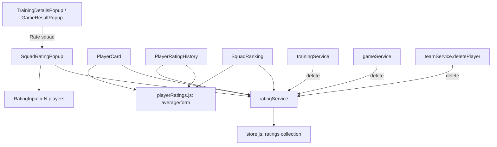

# Player Ratings Design

**Spec**: `.specs/features/09-player-ratings/spec.md`
**Status**: Approved

---

## Architecture Overview

Follows the `08-player-cards` shape exactly: a thin `ratingService` collection
with cascade hooks, pure aggregation in `src/lib/`, a shared input control, one
popup that rates a whole squad, and two entry points (training, game).



---

## Code Reuse Analysis

### Existing Components to Leverage

| Component | Location | How to Use |
|---|---|---|
| `cardService` | `src/services/cardService.js` | Copy its shape 1:1 for `ratingService`: `getCollection/setCollection`, `newId()`, cascade `removeByX` hooks called from `trainingService.delete`, `gameService.delete`, `teamService.deletePlayer` |
| `store.js` collection registry | `src/services/store.js` | Add `ratings: []` to `DATE_FIELDS` (no date fields of its own — it references training/game dates, doesn't store them) |
| `playerCards.js` | `src/lib/playerCards.js` | Same "pure function, never mutates, AD-004" pattern for `playerRatings.js` |
| `GameCardsSection.jsx` | `src/components/GameCardsSection.jsx` | Pattern for a squad-list-with-per-row-controls inside a popup — scrollable `<ul>`, `refreshX` callback re-fetching after mutation |
| `*Popup` overlay pattern | `TrainingDetailsPopup.jsx`, `GameResultPopup.jsx` | Fixed overlay, `onClose`, action buttons in a footer row |
| `ConfirmationPopup` | `src/components/ConfirmationPopup.jsx` | Reuse for history-entry delete confirmation (T8), consistent with card/training/game deletes |
| `datetime.js` | `src/lib/datetime.js` | Not directly reusable (it's input-value formatting) — history view formats dates with `toLocaleString()` like `TrainingDetailsPopup` already does |
| `NotFoundError`/`ValidationError` | `src/lib/errors.js` | Reuse for rating validation (range, integer) and missing event/player |

### Integration Points

| System | Integration Method |
|---|---|
| `trainingService.delete` | Calls `ratingService.removeByEvent("training", id)` after removing the training (mirrors `gameService.delete` → `cardService.removeByGame`) |
| `gameService.delete` | Calls `ratingService.removeByEvent("game", id)` after removing the game |
| `teamService.deletePlayer` | Calls `ratingService.removeByPlayer(playerId)` after removing the player (mirrors existing `cardService.removeByPlayer` call) |
| `TrainingDetailsPopup` / `Trainings.jsx` | New "Rate squad" button opens `SquadRatingPopup` with `eventType: "training"` |
| `GameResultPopup` / `Games.jsx` | New "Rate squad" button opens `SquadRatingPopup` with `eventType: "game"`, alongside the existing `GameCardsSection` |
| `PlayerCard` | Reads `ratingService.getByPlayer` + event lists to compute average/form via `playerRatings.js` |
| `Teams.jsx` | Mounts `SquadRanking` for the selected team |

---

## Components

### `ratingService`

- **Purpose**: CRUD + upsert + cascade for the `ratings` collection.
- **Location**: `src/services/ratingService.js`
- **Interfaces**:
  - `setRating({ playerId, eventType, eventId, value }): Promise<Rating>` — upserts by `(playerId, eventType, eventId)`; `value` must be an integer 0–10 or `null` (clearing removes the record)
  - `getByEvent(eventType, eventId): Promise<Rating[]>`
  - `getByPlayer(playerId, eventType?): Promise<Rating[]>` — optional type filter, used for RATE-02.4's training/game/combined split
  - `remove(id): Promise<void>`
  - `removeByEvent(eventType, eventId): Promise<void>` — cascade hook
  - `removeByPlayer(playerId): Promise<void>` — cascade hook
- **Dependencies**: `store.js`, `lib/id.js`, `lib/errors.js`
- **Reuses**: `cardService` shape

### `playerRatings.js`

- **Purpose**: Pure aggregation — average, form, ranking. Takes ratings **and** the events they reference (trainings + games) as plain arrays so it can join for the event date without a service dependency (design question 2: aggregator does the join, caller passes joined-ready arrays — keeps this file service-free like `playerCards.js`).
- **Location**: `src/lib/playerRatings.js`
- **Interfaces**:
  - `average(ratings): number|null` — mean to 1 decimal, `null` when empty
  - `form(ratings, events, n = 5): { value: number|null, count: number }` — `events` is a `Map`/array of `{ id, type, date }` used to sort by date descending; ties broken by `id` string compare for determinism
  - `filterByType(ratings, eventType): Rating[]` — supports training-only / game-only / combined (pass undefined for combined)
  - `rankSquad(players, ratingsByPlayer): { player, average }[]` — descending by average, `null` averages sorted last, ties broken by player `id`
- **Dependencies**: none (pure)
- **Reuses**: `playerCards.js` conventions (never mutate, `??` for missing)

**Recompute cost (design question 3):** `rankSquad` and a future dashboard batch call take **all players' ratings already grouped** (`Map<playerId, Rating[]>`) rather than looping and re-filtering the full collection per player — callers build the grouping once (`getByPlayer`-per-team via `getByEvent`-style bulk read is not needed since `ratingService.getByPlayer` is already O(collection) per call; `SquadRanking` fetches the collection once with `getAll`-style access, not exposed on the service — instead it fetches `getByEvent` per event or reuses `getByPlayer` per player only for the single-player `PlayerCard`/`PlayerRatingHistory` case where one call is correct). Concretely: `ratingService` gains no batch method in this feature (out of scope per T2's own signature), but `playerRatings.js` functions accept pre-fetched arrays so a future batch caller (`11-dashboard`) can fetch once and call the pure functions per player without re-touching the store.

### `RatingInput.jsx`

- **Purpose**: Single-player 0–10 input (design question 5: **number input** with `min=0 max=10 step=1`, not a slider or button row — fastest to reuse existing Tailwind form patterns from `GameResultPopup`'s score inputs, and a number input handles keyboard entry for 25+ players faster than clicking a 0–10 button row per player).
- **Location**: `src/components/RatingInput.jsx`
- **Interfaces**: `<RatingInput value={number|null} onChange={(number|null) => void} label={string} />`
- **Dependencies**: none
- **Reuses**: Tailwind input classes from `GameResultPopup`

### `SquadRatingPopup.jsx`

- **Purpose**: Rate every player in an event's team in one submit.
- **Location**: `src/components/SquadRatingPopup.jsx`
- **Interfaces**: `<SquadRatingPopup eventType={"training"|"game"} eventId={string} teamId={string} onClose={() => void} />`
- **Dependencies**: `teamService.getAll` (to read the team's players), `ratingService`
- **Reuses**: `RatingInput`, `*Popup` overlay pattern, `GameCardsSection`'s scrollable-list-in-popup layout

### `PlayerRatingHistory.jsx`

- **Purpose**: List + delete a player's individual ratings.
- **Location**: `src/components/PlayerRatingHistory.jsx`
- **Interfaces**: `<PlayerRatingHistory playerId={string} onChange={() => void} />` (calls `onChange` after a delete so `PlayerCard` recomputes)
- **Dependencies**: `ratingService`, needs event dates → also reads `trainingService.getAll` + `gameService.getAll` to resolve each rating's event date
- **Reuses**: `ConfirmationPopup`

### `SquadRanking.jsx`

- **Purpose**: Rank the selected team by average rating, with a training/game/combined toggle.
- **Location**: `src/components/SquadRanking.jsx`
- **Interfaces**: `<SquadRanking team={Team} />`
- **Dependencies**: `ratingService`, `playerRatings.js`
- **Reuses**: `rankSquad`

---

## Data Models

```typescript
interface Rating {
  id: string;
  playerId: string;
  eventType: "training" | "game"; // design question 1: (eventType, eventId) pair, not two nullable fields —
                                   // keeps the collection uniform, matches the spec's stated key, and makes
                                   // both cascades (`removeByEvent("training", id)`, `removeByEvent("game", id)`)
                                   // a single code path instead of two nullable-field branches
  eventId: string;
  value: number; // integer 0-10; absent player = no record (never 0)
}
```

**Relationships**: `(playerId, eventType, eventId)` is a unique key enforced by `setRating`'s upsert (find-and-replace, not push, when a match exists). Deleting the referenced training, game, or player cascades to delete matching ratings (edge cases in spec).

---

## Error Handling Strategy

| Error Scenario | Handling | User Impact |
|---|---|---|
| Rating value outside 0–10 or non-integer | `ratingService.setRating` throws `ValidationError` before writing | `SquadRatingPopup` catches, shows inline error, does not close |
| Unknown event/player id passed to `setRating` | Not validated against `teamService`/`trainingService`/`gameService` (spec doesn't require it — `SquadRatingPopup` only ever passes ids it just read) | N/A |
| `remove(id)` on a non-existent rating | No-op filter, like `cardService.remove` | N/A |

---

## Risks & Concerns

| Concern | Location (file:line) | Impact | Mitigation |
|---|---|---|---|
| `PlayerCard.jsx` and `Teams.jsx` already do multiple sequential service round-trips per render (`cardService.getByPlayer` + `gameService.getAll`) | `src/components/PlayerCard.jsx:16-30` | Adding rating fetches doubles the round-trips; harmless at mock-data scale, would need batching at real scale | Out of scope for this feature — `11-dashboard`'s design notes already flag batch aggregation as a future task |
| No shared cascade registry exists yet — cascades are hand-wired per service call (`gameService.delete` calling `cardService.removeByGame`) | `src/services/gameService.js:56-59` | This feature adds three more hand-wired call sites, the same pattern repeated a third time | Accepted per design question 4: two instances (`08`) wasn't yet the point of generalizing; three is still below where the deep-module skill would recommend extracting a registry, and the pattern is trivial to grep for. Noted here so `11-dashboard` or later can decide to extract if a fourth consumer appears. |

> No other concerns found.

---

## Tech Decisions (only non-obvious ones)

| Decision | Choice | Rationale |
|---|---|---|
| Event reference shape | `(eventType, eventId)` pair | See Data Models — matches spec's stated key, one cascade code path |
| Aggregation placement | Pure functions take pre-fetched `ratings` + `events` arrays; no service dependency in `src/lib/playerRatings.js` | Matches `08`'s placement (`lib/playerCards.js` is service-free); callers (components) do the join |
| Recompute cost | No batch method added to `ratingService` this feature; pure functions accept pre-grouped input so a future batch caller can fetch once | Keeps `ratingService` thin per `08`'s pattern; batching is `11-dashboard`'s stated concern, not this feature's |
| Cascade mechanism | Hand-wired per-service calls, same as `08` | Third instance is still small; extraction deferred (see Risks) |
| Rating input affordance | Native `<input type="number" min=0 max=10 step=1>` | Matches existing score-input pattern in `GameResultPopup`; fastest for keyboard-driven bulk entry across a large squad |

---

## Tips

(n/a — implementation reference only)
