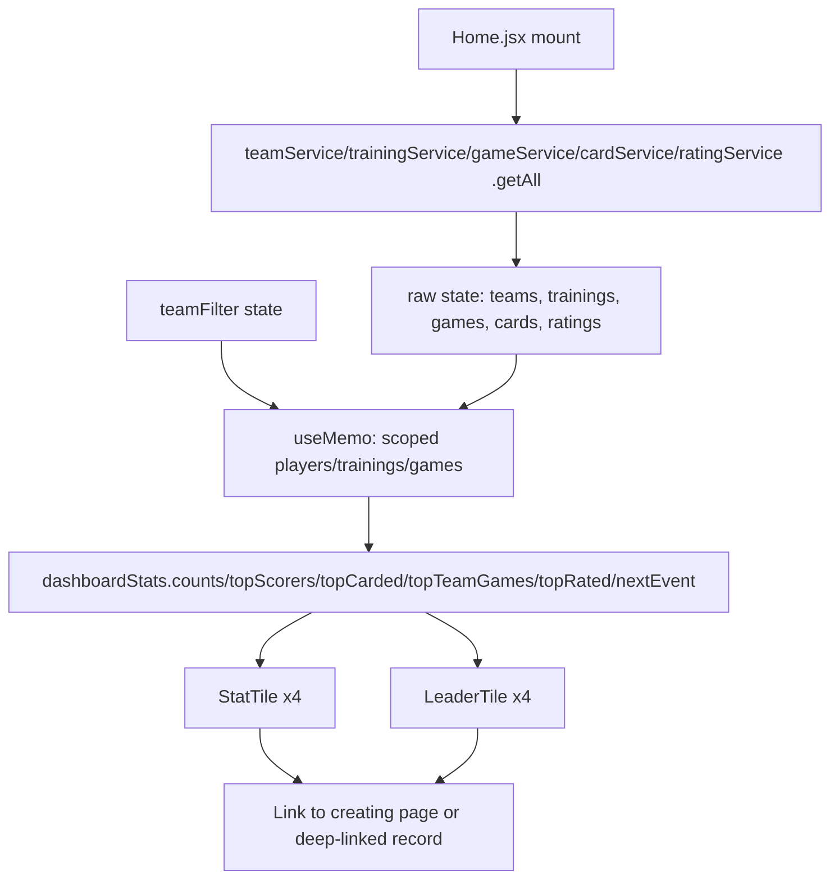

# Dashboard Design

**Spec**: `.specs/features/11-dashboard/spec.md`
**Status**: Approved

---

## Architecture Overview

`Home.jsx` loads every raw collection once on mount (`teams`, `trainings`,
`games`, `cards`, `ratings`) into plain `useState` arrays, plus a `loading`
flag and a `teamFilter` (`teamId | null`) state. All eight tiles' numbers are
derived from that raw state via `useMemo`, calling pure functions in
`src/lib/dashboardStats.js`. Changing the team filter never re-fetches —
it only changes which slice of the already-loaded arrays feeds the memo, so
recomputation is synchronous and reload-free (AC DASH-08.4).



---

## Code Reuse Analysis

### Existing Components to Leverage

| Component | Location | How to Use |
|---|---|---|
| `cardTotals(cards, playerId, teamGameIds)` | `src/lib/playerCards.js` | Called once per player inside `topCarded` — no batch method needed, this is a pure loop over an already-fetched array |
| `average(ratings)` | `src/lib/playerRatings.js` | Called once per player inside `topRated`, after grouping ratings by `playerId` |
| `hasResult(game)` | `src/lib/gameResult.js` | Defines "played" for both the Games count tile and `topTeamGames` |
| `toEvents(trainings, games, teams)` | `src/lib/calendarEvents.js` (feature 10) | Reused inside `nextEvent` to get a merged, invalid-date-filtered, `{id, type, date, title, teamName, sourceId}` list — avoids re-deriving date validation and team-name lookup |
| Tile markup (`border px-3 py-2 rounded-2xl`) | `src/pages/Home.jsx` (current placeholder) | Base class list for `StatTile`/`LeaderTile` |
| `?training=<id>` / `?game=<id>` deep-link routes | `10-calendar-navigation` (`Trainings.jsx`, `Games.jsx`, `useDeepLinkPopup.js`) | The next-event tile builds the exact same href shape; no new route handling needed |

### Integration Points

| System | Integration Method |
|---|---|
| `ratingService` | **New method added**: `getAll()` (mirrors the existing `cardService.getAll()` shape exactly). Needed because the dashboard is the first squad-wide consumer of ratings — every other caller so far reads by event or by player. |
| `cardService`, `gameService`, `trainingService`, `teamService` | No changes — existing `getAll()` methods cover every read this feature needs. |

---

## Approach Exploration

**Option A — one `dashboardStats(data, teamId)` mega-function returning `{ counts, topScorers, ... }`.** Efficient (one call), but couples all eight tiles' logic into one function body and one return shape; a change to one tile's rule risks a merge conflict or an accidental regression in another tile's field. Testing also gets harder — every test has to construct input for tiles it doesn't care about.

**Option B — several small pure exports in one `dashboardStats.js` file, each taking already-scoped data** (`counts`, `topScorers`, `topCarded`, `topTeamGames`, `topRated`, `nextEvent`). `Home.jsx` calls each inside one `useMemo` block. Matches `tasks.md` T1's literal function list, keeps each function independently unit-testable with a minimal fixture, and each tile only re-renders logic it actually reads.

**Recommendation: Option B.** It is what T1's Done-when criteria already assume, it is more testable, and the "one file" grouping still keeps the eight functions co-located and discoverable — the coupling concern in Option A is avoided while keeping the "one aggregation module" property Option A was going for.

---

## Components

### `src/lib/dashboardStats.js`

- **Purpose**: Pure functions producing every tile's figures from already-fetched collections. No fetching, no React.
- **Location**: `src/lib/dashboardStats.js`
- **Interfaces**:
  - `counts({ teams, trainings, games }, teamId?)` → `{ teams: number, trainings: { total, past, upcoming }, games: { total, played, upcoming } }` — unfiltered when `teamId` is omitted; a training/game with no team (or an unknown team) is excluded when `teamId` is given, counted when it isn't (edge case).
  - `topScorers(players, n)` → `Array<{ id, name, value }>`, sorted desc by `goals`, zero excluded, ties grouped and all shown, capped at `MAX_LEADER_ENTRIES` with an `overflow` count on the returned array (`result.overflow`).
  - `topCarded(players, cards, n)` → `Array<{ id, name, value: { yellow, red } }>`, ranked by `yellow + red` desc, zero-total players excluded, same tie/cap rules as `topScorers`.
  - `topTeamGames(teams, games, n)` → `Array<{ id, name, value }>` — teams ranked by count of **played** games (`hasResult`), zero excluded. This function is not explicitly named in `tasks.md` T1's bullet list, but T5's Done-when ("Most Games shows games played per team") requires team-scoped ranking that no other T1 function produces — added here to close that gap (see Risks & Concerns).
  - `topRated(players, ratings, n)` → `Array<{ id, name, value }>`, ranked by `average()` (one decimal), unrated (`null` average) excluded.
  - `nextEvent(trainings, games, teams)` → the single soonest future event as `{ id, type, date, title, teamName, sourceId }` (the exact `calendarEvents` shape) or `null`. Built on `toEvents`, filtered to `date >= now`, sorted with `calendarEvents`'s existing deterministic tie-break, first item taken. `teams` is an added parameter versus the literal T1 signature — needed because AC DASH-06.1 requires a team label in the output, which `toEvents` already produces from `teams` (see Tech Decisions).
- **Dependencies**: `src/lib/playerCards.js`, `src/lib/playerRatings.js`, `src/lib/gameResult.js`, `src/lib/calendarEvents.js`.
- **Reuses**: everything in the Code Reuse table above. Never mutates an input array (AD-004).

### `src/components/StatTile.jsx`

- **Purpose**: One headline number (or a clickable custom value, for the next-event tile) with an optional breakdown line, a loading placeholder, and a signposted empty state.
- **Location**: `src/components/StatTile.jsx`
- **Interfaces**: `StatTile({ label, value, breakdown?, emptyHref?, emptyLabel?, loading?, href?, onClick? })`
  - `loading` → renders a placeholder (`—` / skeleton bar), never `0`.
  - `value == null || value === 0` (and not loading) → renders "No data yet" plus a link (`emptyHref`) to the page that creates that record.
  - `href` or `onClick` present → the tile's root renders as a real `<Link>`/`<button>`, focusable and activatable like `10`'s calendar events, satisfying the next-event tile's click-through (AC DASH-06.3) without a third component.
- **Dependencies**: `react-router-dom`'s `Link` (only when `href` is given).
- **Reuses**: the placeholder tile's `border px-3 py-2 rounded-2xl` shell.

### `src/components/LeaderTile.jsx`

- **Purpose**: A ranked top-N list (players or teams) with shared ranks for ties, a capped-overflow indicator, and the same empty/loading states as `StatTile`.
- **Location**: `src/components/LeaderTile.jsx`
- **Interfaces**: `LeaderTile({ label, entries, renderValue?, loading?, emptyHref?, emptyLabel?, note? })`
  - `entries`: `Array<{ id, name, value }>` (from `dashboardStats`), already ranked/tied/capped by the lib layer — the component only renders rank numbers and the overflow line if `entries.overflow` is set.
  - `renderValue(value)`: optional formatter, used for the cards tile's `{yellow, red}` shape and the ratings tile's one-decimal average.
  - `note`: optional caption under the label — used for the Most Games tile's "team appearances, not individual" disclosure (AC DASH-05.2).
- **Reuses**: `StatTile`'s empty/loading markup conventions (same classes, not a shared base component — the two are different enough in body shape that extracting a common wrapper would be a premature abstraction for two call sites).

### Team filter (inline in `Home.jsx`, not extracted)

Teams.jsx, Trainings.jsx and Games.jsx already duplicate a sidebar
`SelectableListItem` list for team selection. `Home.jsx`'s layout is a tile
grid with no sidebar column, so that pattern doesn't fit visually — a plain
`<select>` above the tile grid is simpler and matches what `tasks.md`
originally described. Extracting one shared `TeamFilter` used by all four
pages would mean refactoring three files outside this feature's scope
(`Teams.jsx`, `Trainings.jsx`, `Games.jsx` are not in any T1–T8 file list).
**Decision: build the filter inline in `Home.jsx` for this feature; flag the
shared-component extraction as a deferred idea** rather than doing it here.

---

## Data Models

No new persisted entities. `dashboardStats.js` consumes the existing shapes
(`Team`, `Player`, `Training`, `Game`, `Card`, `Rating`) as already defined by
`src/model/seed.js` and the services layer.

```typescript
interface LeaderEntry {
  id: string | number;
  name: string;
  value: number | { yellow: number; red: number };
}

interface RankedList extends Array<LeaderEntry> {
  overflow?: number; // set only when capped (edge case: 20+ tied)
}

interface NextEvent {
  id: string;          // "training-<id>" | "game-<id>" (calendarEvents shape)
  type: "training" | "game";
  date: Date;
  title: string;
  teamName: string;
  sourceId: string | number;
}
```

---

## Error Handling Strategy

| Error Scenario | Handling | User Impact |
|---|---|---|
| A `getAll()` call rejects on mount | `try/catch` per collection, matching the `console.error` + partial-render pattern already used in `Trainings.jsx`/`Games.jsx` | Tiles for the failed collection show their empty state; other tiles still render |
| Store not yet seeded when `Home` mounts | `loading` stays `true` until every `getAll()` promise settles | Every tile shows its loading placeholder, never a `0` (edge case) |
| A training/game/rating references a deleted team or player | Excluded naturally — players are sourced by `flatMap`ping the currently-loaded `teams` array, so a deleted team's players are never in that array to begin with | Leader tiles never show a phantom entry; no extra filtering code needed |

---

## Risks & Concerns

| Concern | Location (file:line) | Impact | Mitigation |
|---|---|---|---|
| `tasks.md` T1's function list omits a team-scoped "games played per team" aggregator, but T5's Done-when requires exactly that for the Most Games tile | `.specs/features/11-dashboard/tasks.md:101-115` (T1) vs `:213-220` (T5) | Without it, T5 cannot be implemented from T1's output alone | Add `topTeamGames(teams, games, n)` to T1's scope (documented above); flagged here rather than silently added so the gap is visible |
| `ratingService` has no `getAll()`; every existing caller reads by event or by player | `src/services/ratingService.js` | `topRated` cannot batch-read every player's ratings without one | Add `ratingService.getAll()`, mirroring `cardService.getAll()`'s existing one-line shape — the same kind of minimal addition `09-player-ratings`' design already anticipated |
| No loading convention exists anywhere else in the app (every other page reads via bare `useEffect`/`useState` with no flag) | `src/pages/Trainings.jsx`, `src/pages/Games.jsx`, etc. | Retrofitting a loading flag everywhere would be scope creep | Introduce the flag **only** in `Home.jsx` for this feature; do not retrofit other pages |
| `nextEvent`'s signature gains a `teams` parameter beyond what `tasks.md` T1 literally states (`nextEvent(trainings, games)`) | `.specs/features/11-dashboard/tasks.md:107` | A literal reading of tasks.md would produce a function that can't fill in `teamName`, failing AC DASH-06.1 | Signature is `nextEvent(trainings, games, teams)`; documented here and will carry a one-line comment at the implementation site, not a silent deviation |

> No security, performance, or test-coverage-gap concerns beyond the above — this feature only reads already-loaded in-memory arrays; there is no new persistence, network call, or auth surface.

---

## Tech Decisions

| Decision | Choice | Rationale |
|---|---|---|
| Aggregation shape | Several small pure functions in one file (Option B) | See Approach Exploration — matches T1's Done-when list, keeps each function independently testable |
| "Games played" definition | `hasResult(game)` — a game with a recorded score | Matches the existing `gameService.getPlayed`/`Games.jsx` "Played" bucket; the same word ("played") should mean the same thing on the dashboard as it does on the Games page |
| Leader-tile tie/cap algorithm | Sort desc by value (ties broken by name asc); walk whole value-tiers until the cumulative count ≥ `n`; hard-cap the *rendered* list at `MAX_LEADER_ENTRIES = 10` with an `overflow` count beyond that | Satisfies "show all ties" (AC DASH-05.4) for the common case while still bounding the 20-tied edge case (spec's own escape hatch: "cap the visible list and indicate the overflow") |
| Team filter UI | Inline `<select>` in `Home.jsx`, not an extracted shared `TeamFilter` | Extraction would require touching `Teams.jsx`/`Trainings.jsx`/`Games.jsx`, outside this feature's file list (see Components section) |
| `ratingService.getAll()` | Added, mirroring `cardService.getAll()` | Minimal service-layer addition; no batch method invented beyond what the existing pattern already does elsewhere |
| Player/team-deletion edge case | No extra filtering code — players are always sourced via `flatMap(teams, t => t.players)` from the just-loaded `teams` array | A deleted team is simply absent from `teams`, so its players can never appear; adding an explicit exclusion check would be redundant |

> No new project-level (`AD-NNN`) decisions — everything above is feature-local. The `ratingService.getAll()` addition follows the existing `cardService`/`gameService`/`trainingService`/`teamService` `getAll()` convention rather than establishing a new one.

---

## Task List Amendment (carried into Execute)

T1's "Done when" list is extended with one bullet not present in `tasks.md`,
per the Risks & Concerns entry above:

- [ ] `topTeamGames(teams, games, n)` returns the top `n` teams by played-game count (`hasResult`), zero excluded, same tie/cap rules as the player leader functions — required by T5's Most Games tile.

T5's "Reuses" line implicitly assumes this function exists; T1's test count
target (26) is a `tasks.md`-authored estimate and will be exceeded slightly
to cover this added function, consistent with how estimates were treated in
`10-calendar-navigation` (guidance, not a hard gate).
