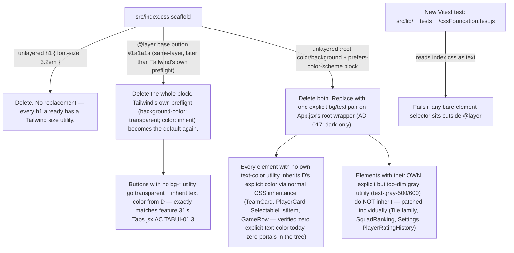

# CSS Foundation Reset Design

**Spec**: `.specs/features/33-css-foundation-reset/spec.md`
**Status**: Approved

---

## Architecture Overview

Three independent cascade defects in `src/index.css`, one fix strategy each,
plus one regression guard. No component owns business logic here — this is
pure styling-layer surgery.

**Root-cause correction from the spec's problem statement:** research during
design (reading `node_modules/tailwindcss/preflight.css`) found the `button`
rule is *not* an unlayered-beats-everything bug — it's properly inside
`@layer base`, but it's declared *after* Tailwind's own `@layer base` button
reset in the same file, so it wins by ordinary same-layer source order.
Deleting it restores Tailwind's own reset (`background-color: transparent;
color: inherit`) rather than requiring an explicit background added to every
plain button in the app. This is why removing the code is nearly always
enough — a scaffold add-on that needs deleting is doing much less work than
its instructions elsewhere in `docs/09-styling.md` implied when they described
it as load-bearing.

The `h1` and `:root` rules genuinely are unlayered (bare top-level selectors),
so they do beat every Tailwind layer regardless of specificity — those two
must be deleted outright.

---

## Code Reuse Analysis

### Existing Components to Leverage

| Component | Location | How to Use |
|---|---|---|
| `App.jsx`'s outer wrapper `
` | `src/App.jsx:29` | Gains the app's one explicit `bg-*`/`text-*` pair. Already the single root every authenticated page renders inside (AD-012), so it's the correct — and only — place to set this once. |
| `--color-lightblack` (`#171717`) | `src/index.css` `@theme` | Stays the card/surface color, unchanged. The new page background is a *different*, slightly darker value so cards remain visually distinct against it (verified: `#171717` vs `#0a0a0a` is a real, visible step). |
| `--color-hover` (`rgb(38,38,38)`, `bg-hover`/`hover:bg-hover`) | `src/index.css` `@theme` | Reused as the Tile family's new hover state, replacing `hover:bg-gray-50` (a light-mode leftover) — matches the hover token `TrainingCard`/`SelectableListItem` already use on the same dark surfaces. |
| `--color-lightgrey` (`rgb(71,71,71)`, `hover:bg-lightgrey`) | `src/index.css` `@theme` | Reused verbatim to replace the deleted global `a:hover` rule (which hard-coded the identical `rgb(71, 71, 71)`) — applied directly to each `Sidebar` `<Link>` instead of a global element selector. |

### Integration Points

| System | Integration Method |
|---|---|
| Feature 31's `Tabs.jsx` | No code change. Its inactive-tab class set (`text-gray-700 hover:bg-gray-200`, no `bg-*`) already matches AC TABUI-01.3 exactly — it was only ever wrong because the scaffold button rule painted over it. Deleting that rule fixes it without touching the component, and Task 6 adds a rendered-value regression test proving it. |
| `docs/09-styling.md` | Rewritten (Task 7) to describe the post-reset baseline — the current doc explicitly documents the bug ("Unifying this is worth doing before any visual polish") and would otherwise go stale the moment this ships. |
| `.specs/STATE.md` | New `AD-017` entry (Task 7) — dark-only, no unlayered element selectors, background/text set once on the app root. |

---

## Components

### `src/index.css` (modified, not a component but the core change)

- **Purpose**: Remove every unlayered/scaffold rule; keep only Tailwind's
  import, the `@theme` tokens, and the properly-layered structural rules
  (`body`'s margin/flex/min-size — unrelated to color, left alone).
- **Location**: `src/index.css`
- **Removed entirely**: `h1 { font-size: 3.2em }`, `:root`'s `color-scheme`/
  `color`/`background-color`, the whole `@media (prefers-color-scheme: light)`
  block, the whole `@layer base { button {...} }` block, `a:hover`.
- **Kept**: `@import "tailwindcss"`, `@theme {...}` token block, `:root`'s
  non-color properties (`font-family`, `line-height`, `font-weight`,
  `font-synthesis`, `text-rendering`, `-webkit-font-smoothing`,
  `-moz-osx-font-smoothing`) — none of these are contested by Tailwind and
  none are color/background, so out of this feature's bug class, `body`'s
  structural rule (`margin`, `display: flex`, `place-items: center`,
  `min-width`, `min-height`) unchanged for the same reason.
- **Dependencies**: none.
- **Reuses**: n/a — this is the file being cleaned.

### `src/App.jsx` (modified)

- **Purpose**: Own the app's one explicit background/text pair, replacing
  the deleted `:root` values.
- **Location**: `src/App.jsx:29`
- **Change**: the authenticated wrapper div gains `bg-neutral-950
  text-gray-100` (exact values pinned in Tech Decisions below) alongside its
  existing `flex w-screen h-screen overflow-hidden`.
- **Dependencies**: none new.
- **Reuses**: nothing else changes about this component; `PrivateRoute`,
  routing, `Sidebar` placement all untouched.

### `src/components/Sidebar.jsx` (modified)

- **Purpose**: Replace the deleted global `a:hover` rule with an explicit
  utility on each link, matching every other hover-pill in the app.
- **Location**: `src/components/Sidebar.jsx`
- **Change**: each `<Link>` gains `hover:bg-lightgrey rounded-xl` (both
  values already exist as tokens/utilities; `rounded-xl` = `0.75rem` = `12px`,
  an exact match for the deleted rule's `border-radius: 12px`).
- **Dependencies**: none.
- **Reuses**: `--color-lightgrey`, already used identically by every icon
  button in `TeamCard`/`PlayerCard`/`ReferenceListManager`.

### The Tile family — `Tile.jsx`, `NextGameCard.jsx`, `StatTile.jsx`, `ListTile.jsx` (modified)

- **Purpose**: Give the dashboard's bordered, no-fill "callout" surfaces
  (`Tile`'s `TILE_CLASS`, `NextGameCard`'s matching hand-copied variant) an
  explicit dark surface, consistent with every other card in the app
  (`TeamCard`/`PlayerCard`'s `bg-lightblack`) instead of silently depending on
  an ambient light page background that has never actually existed. Also
  bumps each component's own explicit-but-too-dim `text-gray-500` (measured:
  **4.10:1** against the new page background, **3.71:1** against a
  `bg-lightblack` surface — both below the 4.5:1 floor) to `text-gray-400`
  (measured: **7.06–7.80:1**, comfortably clears AA at either surface).
- **Location**: `src/components/Tile.jsx` (`TILE_CLASS`, `INTERACTIVE_CLASS`),
  `src/components/NextGameCard.jsx`, `src/components/StatTile.jsx`,
  `src/components/ListTile.jsx`
- **Change**: `TILE_CLASS`/`NextGameCard`'s className gain `bg-lightblack`;
  `INTERACTIVE_CLASS`'s `hover:bg-gray-50` becomes `hover:bg-hover`
  (`NextGameCard` the same); every `text-gray-500` in these four files becomes
  `text-gray-400`. `LeaderTile.jsx` already uses `text-gray-300`/`gray-400` —
  confirmed already correct, not touched.
- **Dependencies**: `--color-lightblack`, `--color-hover` (existing tokens).
- **Reuses**: the exact surface convention `TeamCard`/`PlayerCard` already
  established — this makes the Tile family consistent with the rest of the
  app's card language rather than inventing a new one.

### `SquadRanking.jsx`, `Settings.jsx`, `PlayerRatingHistory.jsx` (modified — spot text-color bumps)

- **Purpose**: Same too-dim-gray defect as the Tile family, in three
  standalone locations that render directly on the app background or inside
  a dark card, not inside a white popup.
- **Location/Change**:
  - `SquadRanking.jsx:85` — `text-gray-500` → `text-gray-400` ("No rated
    players yet.", renders directly on the Teams page background)
  - `Settings.jsx:181` — `text-gray-600` → `text-gray-400` (Advanced panel's
    intro paragraph, renders directly on the Settings page background;
    `text-gray-600` is even worse than `text-gray-500` against a dark
    background — never measured as passing at any surface tested)
  - `PlayerRatingHistory.jsx:78` — `text-gray-500` → `text-gray-400` ("No
    ratings recorded yet.", renders inside `PlayerCard`'s `bg-lightblack`
    surface)
- **Confirmed out of scope** (rendered on `bg-white` popups, unaffected by
  this feature's background change — verified each one's actual mount
  point): `ExerciseDetailsPopup.jsx:68`, `SquadRatingPopup.jsx:88`,
  `TrainingSavePopup.jsx:272`, `TrainingDetailsPopup.jsx:96,100`,
  `GameCardsSection.jsx:52` (mounts inside `GameResultPopup`, a `PopupShell`),
  `Calendar.jsx:138,177` (own `bg-white` card per `docs/09-styling.md`),
  `TeamFilterBar.jsx` (`UNPRESSED_CLASS` has its own explicit `bg-transparent`
  inside an explicit `bg-gray-100` track — self-contained, not affected by
  the page background).
- **Dependencies**: none.
- **Reuses**: n/a — one-line class swaps.

### `TeamCard.jsx`, `PlayerCard.jsx`, `SelectableListItem.jsx`, `GameRow.jsx` — confirmed NOT modified

- **Why they need no code change**: verified (via grep, zero hits) that none
  of these four components declares its own text-color utility anywhere in
  its JSX. Today they render legible text only because `:root`'s unlayered
  `color: rgba(255,255,255,.87)` inherits down to them. Once that global rule
  is replaced by an explicit `text-gray-100` on `App.jsx`'s root wrapper
  (above), ordinary CSS inheritance carries the same color down to these
  four components with no changes to their own files — confirmed no
  `ReactDOM.createPortal` exists anywhere in this codebase (grepped, zero
  hits), so there is no code path that would render these components outside
  the App-rooted DOM subtree and lose the inheritance chain.
- This is deliberately called out as its own "component" entry because a
  spec reviewer would otherwise reasonably expect these four — the ones in
  the original bug report — to have the largest diff. They have none.

### `src/lib/__tests__/cssFoundation.test.js` (new)

- **Purpose**: The P3 regression guard. Reads `src/index.css` as plain text
  and asserts no bare element selector exists outside an `@layer` block.
- **Location**: `src/lib/__tests__/cssFoundation.test.js` (co-located with
  other non-component `lib` tests per existing convention; this file has no
  matching `src/lib/cssFoundation.js` — it tests a CSS file directly, the one
  deliberate exception to the "test what the file exports" pattern, noted
  inline in the test file itself)
- **Interfaces**: none (a Vitest test file, not an importable module)
- **Dependencies**: `fs.readFileSync` on `src/index.css`, a small regex-based
  parser (not a full CSS parser — see Tech Decisions).
- **Reuses**: nothing; this is new test infrastructure for a bug class the
  suite has never been able to see.

---

## Data Models

None. This feature touches no persisted data, no service, no schema version.

---

## Error Handling Strategy

| Error Scenario | Handling | User Impact |
|---|---|---|
| A future PR reintroduces an unlayered element selector in `index.css` | `cssFoundation.test.js` fails the suite, naming the offending selector in its assertion message | None (caught before merge) — this is the entire point of Task 6 |
| A component is added later with dark card content but forgets its own text color, relying on inheritance from a context this feature didn't anticipate (e.g., a future portal) | Not automatically caught by this feature — flagged as a residual risk below, not solved here (would require a much larger visual-regression investment, explicitly out of scope per spec.md) | Possible future illegible text; same risk class as today, just narrower after this fix |

---

## Risks & Concerns

| Concern | Location | Impact | Mitigation |
|---|---|---|---|
| Removing `color-scheme: light dark` changes native form-control theming (checkboxes, `<select>` dropdowns, scrollbars) on some browsers/OSes | `src/index.css` (removed `:root` block) | Native controls (e.g. the `<select>` elements in `TrainingSavePopup`, `GameSavePopup`, unassigned-training/game assignment dropdowns) could render with light-mode chrome by default once the browser stops being told "this page supports dark" — but those controls already sit inside `bg-white` popups today, so their existing appearance is unaffected; the only controls outside a popup are the plain `<select>` "Assign to team" dropdowns on `Trainings.jsx`/`Games.jsx`'s unassigned lists, rendered with default (light) OS chrome already since they carry no dark-specific styling. Net risk: negligible, confirmed by inspecting every `<select>` in the codebase. | Manual visual check during Task 4 (browser verification step) of both popup and page-level `<select>` elements after the CSS change. |
| The regression guard (Task 6) is a regex over CSS text, not a real CSS parser — it could false-negative on a selector hidden inside a comment, or false-positive on a selector inside a string value | `src/lib/__tests__/cssFoundation.test.js` | Low: `index.css` is a small, hand-written file (not generated), so a regex tuned to its actual structure (top-level `{`-opening lines vs. `@layer`/`@media`-nested ones) is reliable in practice. A full CSS parser dependency would be disproportionate to a 60-line file. | The test's own test-suite (Task 6) includes a case asserting it currently passes against the *cleaned* file, and a case asserting it fails when the exact original bug (`h1 { font-size: 3.2em }` reinserted unlayered) is present — proving the regex catches the real defect, not a hypothetical one. |
| `TeamFilterBar.jsx`'s `UNPRESSED_CLASS` (`text-gray-600` on its own `bg-gray-100` track) was not re-measured against WCAG numbers in this design, only reasoned about as "self-contained" | `src/components/TeamFilterBar.jsx` | If wrong, an already-shipped (feature 32) component could have a latent contrast issue this feature doesn't fix | Out of scope by construction: this feature fixes pairings broken *by the scaffold-CSS removal*, not pre-existing choices in already-verified features. If `TeamFilterBar` has its own bug, it predates this feature and is a candidate for its own audit finding, not silently absorbed here. |

---

## Tech Decisions

| Decision | Choice | Rationale |
|---|---|---|
| New page background value | `bg-neutral-950` (`#0a0a0a`) | Computed contrast against every gray shade in active use (`gray-400` 7.80:1, `gray-300` 13.44:1, `white` 19.80:1 — all comfortably clear AA/AAA). Distinct from `lightblack` (`#171717`, the card surface) so cards remain visually separated, per the spec's Assumptions row. |
| New text color on the app root | `text-gray-100` | Close to (marginally crisper than) the removed `rgba(255,255,255,.87)`; clears every measured pairing. `text-white` was considered and rejected only because `text-gray-100` is one step softer and already used by `TrainingCard`'s equivalent dark-surface text — matches existing convention rather than introducing a second "white-ish" value. |
| `button` scaffold rule | Delete outright, do not replace | Tailwind's own preflight (`background-color: transparent; color: inherit`) is the correct default once the scaffold's same-layer, later-declared override is gone — verified by reading `node_modules/tailwindcss/preflight.css` directly (Knowledge Verification Chain step 1, confirmed rather than assumed). |
| `a:hover` | Delete the global rule; add `hover:bg-lightgrey rounded-xl` to each `Sidebar` `<Link>` | The deleted rule's exact color (`rgb(71,71,71)`) already exists as the `--color-lightgrey` token, and its `12px` radius is exactly Tailwind's `rounded-xl`. Moving it onto the six links it actually serves removes another bare global element selector rather than just re-layering it, and matches AD-005 (Tailwind utilities for touched UI). |
| Regression guard implementation | Regex-based text assertion in Vitest, not a rendered-DOM contrast test | jsdom does not apply the real CSS cascade from external stylesheets — confirmed this is *why* the original bug shipped despite 1413 passing tests. A static source check targets the actual defect mechanism (unlayered selectors) directly; a fake rendered-contrast check would give false confidence without truly verifying anything, since jsdom can't see the cascade either way. |
| Approach considered and rejected: patch every affected component with its own explicit background/text instead of relying on inheritance | Rejected | Confirmed zero components use `ReactDOM.createPortal` (inheritance chain is safe app-wide) and confirmed zero explicit text-color exists today on `TeamCard`/`PlayerCard`/`SelectableListItem`/`GameRow` (they already depend on inheritance, just from the wrong source). Patching all four individually would touch 4 extra files for zero behavioral difference from the inheritance approach — pure surface-area cost with no corresponding robustness gain given the confirmed absence of portals. |
| Approach considered and rejected: keep both `color-scheme` paths and just fix contrast in each | Rejected | User's explicit decision (AD-017): dark-only. The light path was never a designed theme — this option would mean designing and maintaining a *second* full theme for a codebase that has never actually built one. |

> **AD-017** is recorded in `.specs/STATE.md` `## Decisions` (Task 7): dark-only, no unlayered element selectors, background/text set once on the app root.

---

## Tips reminder (design phase self-check)

- Every component touched is named with an exact reason a reviewer can verify
  independently (grep counts, computed contrast ratios, preflight source).
- The single largest simplification — inheritance handling `TeamCard`/
  `PlayerCard`/`SelectableListItem`/`GameRow` for free — was discovered during
  design research, not assumed at spec time; the spec's Assumptions table
  originally implied per-component patches, and this design deliberately
  supersedes that implication rather than silently doing the smaller amount
  of work with no explanation. Recorded here so Tasks reflects reality.
