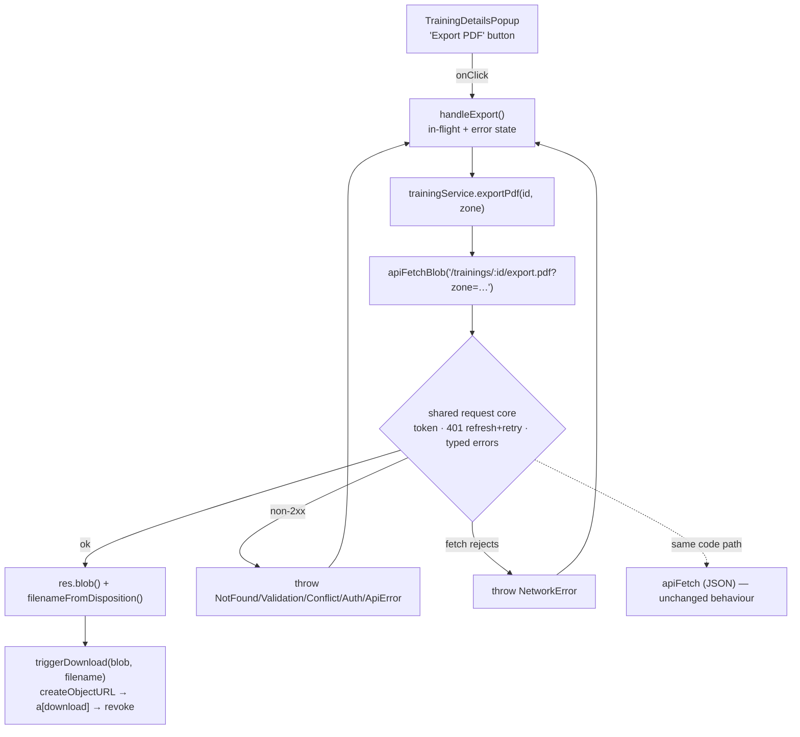

# Training PDF Export (Frontend) — Design

**Spec**: `.specs/features/41-training-pdf-export/spec.md`
**Status**: Draft — awaiting approval

---

## Architecture Overview

One new capability (fetch bytes with auth) plumbed through the existing four-layer
shape the app already uses: component → service → `apiClient` → API. Nothing about the
call graph is new; only the response type is.



The one structural change is inside `apiClient.js`: the body of `apiFetch` splits into a
**shared request core** (token attach, network-error wrap, 401-expired refresh-and-retry,
non-2xx → typed error) plus two thin response readers — `.json()` for `apiFetch`,
`.blob()` + filename for `apiFetchBlob`. `apiFetch`'s external behaviour is unchanged,
which its existing untouched test file proves (`PDFEX-15`).

---

## Approaches Considered

All three deliver the same scoped thing: a button that downloads the training's PDF.

| # | Approach | Verdict |
| --- | --- | --- |
| **A** | **`apiFetchBlob` in `apiClient`, sharing one request core** — refactor `apiFetch`'s body into a core that returns a `Response`, then two readers on top. | ✅ **Recommended.** One token attachment, one refresh dedupe, one error mapper. Any future binary endpoint (game sheets, standings export) is a one-liner. Cost: a real, if small, refactor of the app's most load-bearing module — mitigated by an existing 40+ case test file that must pass untouched. |
| B | **Raw `fetch` inside `trainingService.exportPdf`** — bypass `apiClient` entirely. | ❌ Forks the three things `apiClient` exists to centralise. The 401 refresh would either be missing (an expired token silently fails an export that would have worked) or be a second implementation racing the first — `refreshInFlight` in `apiClient.js:24` dedupes only its own calls. Zero refactor risk, permanent duplication. |
| C | **Open the URL in a new tab / plain `<a href>`** — let the browser download it. | ❌ Not viable, not merely worse. The endpoint requires `Authorization: Bearer …` and the access token lives in memory only (`src/lib/tokenStore.js`, AD-021) — there is no cookie for a browser-initiated navigation to carry. It would 401 every time. Making it work would mean a signed-URL scheme the backend does not have. |

**Recommendation: A.** B is the only real alternative and it trades a bounded, well-tested
refactor for permanent duplication of the auth path.

---

## Conformance with `.specs/STATE.md` Decisions

Every `active` `AD-NNN` was read before designing. The ones this feature touches:

| Decision | Relevance | Conformance |
| --- | --- | --- |
| **AD-020 / AD-021** (real API only, no mock store, token in memory) | Rules out approach C outright — there is no cookie session, so the bytes must be fetched with an explicit header. | **Conform.** |
| **AD-024** (relative `VITE_API_BASE_URL=/api/v1` + nginx same-origin proxy) | The export URL is built by `apiClient` from `BASE_URL`, so it inherits the proxy for free in the container and hits `localhost:8080` cross-origin in dev. In dev the `Content-Disposition` header is only readable because the backend lists it in `exposedHeaders` (`SecurityConfig.kt:84` — verified); through the nginx proxy the header passes through untouched, since `docker/nginx.conf.template` rewrites no response headers on `location /api/`. | **Conform** — no change to either file. **T7 must verify the filename empirically in dev**, not trust this paragraph. |
| **AD-022** (server value wins over client computation) | The filename and the sheet's contents are the server's, not recomputed here; the client only falls back when the header is unusable. | **Conform.** |
| **AD-023** (last-write-wins, no optimistic concurrency) | Export is read-only, so the concurrency model is untouched. | **N/A.** |

**New decision proposed — `AD-026`** (to be appended to `.specs/STATE.md` in T8):

> **Decision**: Binary/non-JSON responses are fetched through a dedicated `apiFetchBlob`
> export in `src/lib/apiClient.js` that shares one request core with `apiFetch`. No
> service may call `fetch` directly.
> **Reason**: The bearer token, the single-flight 401 refresh-and-retry (`refreshInFlight`)
> and the RFC 9457 → typed-error mapping exist in exactly one place today; a raw `fetch`
> in a service would fork all three, and a second refresh implementation would race the
> first rather than dedupe with it.
> **Trade-off**: `apiClient` grows a second exported entry point and an internal
> `Response`-returning core. Accepted; the existing `apiClient.test.js` is the regression
> harness that keeps the JSON path honest.

---

## Code Reuse Analysis

### Existing code to leverage

| Component | Location | How it is used |
| --- | --- | --- |
| `apiFetch`'s token/refresh/error logic | `src/lib/apiClient.js:76-111` | **Extracted**, not copied, into the shared request core both readers call. |
| `doRefresh` + `refreshInFlight` | `src/lib/apiClient.js:24-49` | Reused as-is — the blob path joins the same in-flight promise (`PDFEX-10`). |
| `toTypedError` | `src/lib/apiClient.js:51-63` | Reused as-is; error bodies are `problem+json` even for a PDF route, so the mapping needs no change. |
| Typed errors | `src/lib/errors.js` | Reused; no new error class is introduced. |
| `notifyAuthFailure` → `PrivateRoute` | `src/lib/tokenStore.js`, `src/App.jsx` | Reused for `PDFEX-26` — the popup deliberately shows nothing on `AuthError`. |
| `Button` (`variant="secondary"`, `disabled`) | `src/components/Button.jsx` | The export button; `disabled:opacity-50 disabled:cursor-not-allowed` is already in `BASE_CLASS`. |
| `PopupActions` row | `src/components/PopupActions.jsx` | The button's home — same slot as `Rate squad`. |
| Inline error pattern (`console.error` + `setError` + `<p className="text-sm text-red-500">`) | `src/components/SquadRatingPopup.jsx:41-70,126` | Copied as a *pattern* for `PDFEX-23…25`, upgraded with `role="alert"`. |
| Service test style (`vi.mock("../../lib/apiClient", …)` + `mockResolvedValueOnce`) | `src/services/__tests__/trainingService.test.js:7-9` | The template for `exportPdf`'s tests — **and a hazard**, see Risks. |
| Popup test style (`vi.mock` apiClient + `createFakeApi`) | `src/components/__tests__/TrainingDetailsPopup.test.jsx:14-21` | The template for the button's tests. |

### Integration points

| System | Integration |
| --- | --- |
| `coach-planner-api` `GET /trainings/{id}/export.pdf` | Unchanged; consumed as specified in its own `01-training-pdf-export` spec. |
| nginx same-origin proxy (`docker/nginx.conf.template`) | Response headers pass through untouched — no config change. |
| Backend CORS `exposedHeaders = [CONTENT_DISPOSITION]` | Already present (`SecurityConfig.kt:84`) — this is what makes the filename readable in `npm run dev`. |

---

## Components

### `filenameFromDisposition(header, fallback)`

- **Purpose**: Turn a server-supplied `Content-Disposition` header into a safe download filename.
- **Location**: `src/lib/contentDisposition.js` (new)
- **Interface**: `filenameFromDisposition(header: string | null, fallback: string): string`
- **Behaviour**: prefers RFC 5987 `filename*=UTF-8''…` (percent-decoded) over `filename=`; strips surrounding quotes; keeps only the final path segment (`../a/b.pdf` → `b.pdf`); returns `fallback` when the header is missing, unparseable, or reduces to nothing.
- **Dependencies**: none — a pure string function.
- **Why its own module**: it parses untrusted input and has four branches; inside `apiClient` it would be untestable except through a stubbed `fetch`.

### `apiFetchBlob(path, { fallbackFilename })`

- **Purpose**: The binary sibling of `apiFetch`.
- **Location**: `src/lib/apiClient.js` (modify)
- **Interface**: `apiFetchBlob(path: string, opts?: { fallbackFilename?: string }): Promise<{ blob: Blob, filename: string }>`
- **Dependencies**: the shared request core, `filenameFromDisposition`.
- **Reuses**: everything in the Code Reuse table's first four rows.
- **Note**: `GET` only by design — nothing in scope uploads binary. Adding a method parameter now would be an untested branch.

### `triggerDownload(blob, filename)`

- **Purpose**: Hand the browser a file download for an in-memory blob.
- **Location**: `src/lib/download.js` (new)
- **Interface**: `triggerDownload(blob: Blob, filename: string): void`
- **Behaviour**: `URL.createObjectURL` → temporary `<a href download>` appended to `document.body` → `.click()` → remove the anchor → `URL.revokeObjectURL` in a `finally`, so the URL is released even if the click throws.
- **Dependencies**: DOM + `URL.createObjectURL`.
- **Testing note**: jsdom implements neither `createObjectURL` nor `revokeObjectURL`; its tests stub both with `vi.stubGlobal`/`vi.spyOn` and assert the anchor's `download` attribute, that `click()` fired, and that the URL was revoked and the anchor detached (`PDFEX-05`).

### `trainingService.exportPdf(id, { zone })`

- **Purpose**: The service-layer wrapper — the only module a component talks to, per the repo's data-layer convention.
- **Location**: `src/services/trainingService.js` (modify)
- **Interface**: `exportPdf(id: string, opts?: { zone?: string }): Promise<{ blob, filename }>`
- **Behaviour**: `zone` defaults to `browserTimeZone()`; the query string is appended only when the zone is a non-empty string, and the value is `encodeURIComponent`-ed (`PDFEX-03`, `PDFEX-04`). Fallback filename: `training-${id}.pdf`.
- **Reuses**: `apiFetchBlob`; the module's existing one-line-wrapper style.

### `browserTimeZone()`

- **Purpose**: The browser's IANA zone, or `null`.
- **Location**: `src/lib/dates.js` (modify — it already owns the API-date helpers)
- **Interface**: `browserTimeZone(): string | null`
- **Behaviour**: `Intl.DateTimeFormat().resolvedOptions().timeZone` or `null` when `Intl` is missing, throws, or yields an empty value.

### `TrainingDetailsPopup` — export button

- **Purpose**: The user-facing half.
- **Location**: `src/components/TrainingDetailsPopup.jsx` (modify)
- **Adds**: `exporting` and `exportError` state; `handleExport`; an `Export PDF` / `Exporting…` `Button` in the existing `PopupActions` row; an inline `role="alert"` line at the end of the popup body.
- **Guard rails**: `if (exporting) return;` at the top of `handleExport` (`PDFEX-21`); `exportError` cleared on entry (`PDFEX-27`); a `useRef` "still mounted" flag so a close mid-flight neither sets state nor fires a download (Edge Cases).
- **Props**: none added — the popup calls the service directly, exactly as it already does for `ratingService` via `SquadRatingPopup`.

---

## Data Models

No entity changes. The only new shape is the transport envelope:

```typescript
interface BlobResponse {
  blob: Blob      // the raw response body (application/pdf here)
  filename: string // from Content-Disposition, or the caller's fallback
}
```

---

## Error Handling Strategy

| Error scenario | Thrown as | Handling | What the coach sees |
| --- | --- | --- | --- |
| Access token expired | — (internal) | Shared core refreshes once and retries once | Nothing — the download just works |
| Refresh fails / session revoked | `AuthError` | `notifyAuthFailure()` → `PrivateRoute` redirects | Redirected to `/signin`; **no inline message** (`PDFEX-26`) |
| Training deleted in another tab | `NotFoundError` | caught in `handleExport` | "This training no longer exists." (`PDFEX-23`) |
| API unreachable / offline / CORS | `NetworkError` | caught in `handleExport` | "Could not reach the server. Please try again." (`PDFEX-24`) |
| Invalid zone rejected by the API | `ValidationError` | generic branch | Generic failure message + `console.error` (`PDFEX-25`) |
| PDF generation blew up server-side (500) | `ApiError` (status 500) | generic branch | Generic failure message + `console.error` (`PDFEX-25`) |
| `URL.createObjectURL` unavailable | plain `Error`/`TypeError` | generic branch | Generic failure message; popup stays usable (Edge Cases) |
| Popup closed mid-flight | — | mounted-ref guard | Nothing; no stray download, no state update |

---

## Risks & Concerns

| Concern | Location | Impact | Mitigation |
| --- | --- | --- | --- |
| **Mock factories omit new exports.** `vi.mock("../../lib/apiClient", () => ({ apiFetch: vi.fn() }))` returns an object with no `apiFetchBlob`; once `trainingService` imports it, Vitest throws *"No 'apiFetchBlob' export is defined on the mock"* — a hard failure, not a warning. | `src/services/__tests__/trainingService.test.js:7`, `src/components/__tests__/TrainingDetailsPopup.test.jsx:14` (and every other file mocking `apiClient`) | The suite breaks in files unrelated to this feature. | **T5's first step**: `grep -rn 'vi.mock("../../lib/apiClient"' src` and add `apiFetchBlob: vi.fn()` to every factory found. This is expected churn, not scope creep — call it out in the commit. |
| **`apiClient` is the app's single most load-bearing module.** Every service and `AuthContext` route through it; a refactor regression breaks everything at once. | `src/lib/apiClient.js` | Catastrophic if silent. | The existing `apiClient.test.js` must pass **completely untouched** (`PDFEX-15`), and is the T2 gate. Any need to edit it means the refactor changed observable behaviour and is wrong. |
| **jsdom has no `URL.createObjectURL`, no `Blob` download, and no real `<a download>` behaviour.** | `src/lib/download.js` (new) | Green tests can coexist with a download that never fires in a real browser. | Isolate all of it in `triggerDownload` and stub at that boundary; then **manually verify once in a real browser** against a running backend (T7's "Done when"). The spec's Success Criteria require this explicitly. |
| **The `Content-Disposition` filename is server-controlled input.** | `src/lib/contentDisposition.js` (new) | A crafted header could suggest a path-like filename. Browsers sanitise `download` themselves, so this is defence in depth, not a live exploit. | `PDFEX-19` — keep only the final path segment; fall back when nothing usable remains. |
| **Cross-origin dev vs. proxied container are different header paths.** | `SecurityConfig.kt:84`, `docker/nginx.conf.template:41-50` | A filename that works in one mode and silently degrades to the fallback in the other. | Both were read, not assumed (backend exposes the header; nginx rewrites no response headers). T7 verifies dev empirically; the container path is covered by the same fallback if it ever regresses. |
| **`TrainingDetailsPopup` has no test covering close-during-async.** | `src/components/__tests__/TrainingDetailsPopup.test.jsx` | An unmounted `setState` warning, or a download firing after the popup is gone. | T7 adds the mounted-ref guard **and** its test. |

---

## Tech Decisions

| Decision | Choice | Rationale |
| --- | --- | --- |
| Where binary transport lives | `apiFetchBlob` in `apiClient` (approach A) | See Approaches; promoted to `AD-026`. |
| Return shape | `{ blob, filename }` | The filename is only derivable from the response headers, which the caller no longer has. Returning the bare blob would force header parsing back into every caller. |
| `apiFetchBlob` is `GET`-only | No `method` option | Nothing in scope needs otherwise; an unused branch is an untested branch. |
| Filename parsing in its own module | `src/lib/contentDisposition.js` | Four branches over untrusted input; pure and directly unit-testable. |
| Download side effect in its own module | `src/lib/download.js` | The only DOM-and-`URL`-dependent code in the feature; isolating it keeps the popup's tests about the popup. |
| `browserTimeZone()` in `dates.js` | Not a new module | `dates.js` already owns date/zone concerns; a one-function module would be noise. |
| Button variant | `secondary` | Matches `Rate squad` — a peer action. `primary` is `Edit`'s; two primaries in one row is a hierarchy error. |
| No new props on `TrainingDetailsPopup` | Service called directly | The popup already owns async work (`SquadRatingPopup` mount, `onDelete`); threading an `onExport` prop through `Trainings.jsx` would add a call site for no behavioural gain. |
| Popup stays open after export | No auto-close | A download is not a mutation; nothing on screen changed. |
