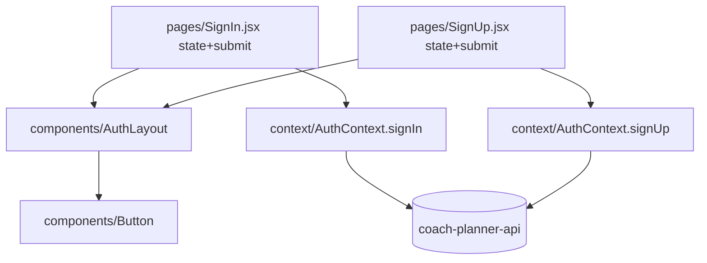

# Auth Screens Refactor Design

**Spec**: `.specs/features/auth-screens-refactor/spec.md`
**Status**: Draft

---

## Architecture Overview

Presentation-only refactor. The stateful auth logic stays entirely in
`context/AuthContext.jsx` (`signIn`, `signUp`) — untouched. Each page remains
the **stateful container** (form state, submit handler, redirect effect,
submitting flag) but delegates its **presentation** to a new shared
`AuthLayout` and reuses the existing `Button`. This mirrors the codebase's
established de-duplication pattern (AD-013 popup shell, AD-016 merged
managers): shared presentational shell, per-instance state.

Routing is unchanged: `App.jsx` mounts `/signin` and `/signup` **outside** the
`PrivateRoute` shell, so neither screen may introduce a `<main>` or an element
with both `.h-screen` and `.overflow-hidden` (asserted by `App.test.jsx`).

---

## Code Reuse Analysis

### Existing Components to Leverage

| Component | Location | How to Use |
| --------- | -------- | ---------- |
| `Button` | `src/components/Button.jsx` | Submit button; use `variant="primary"`, `type="submit"`, `disabled` while submitting. Already provides `focus-visible` outline and `disabled:opacity-50` (satisfies REQ-09 disabled styling + REQ-10 focus). |
| `@theme` tokens | `src/index.css` | `bg-lightblack` (#171717), `bg-lightgrey`, `bg-hover`, plus stock Tailwind `neutral-*`/`blue-*`. Use for the dark card surface + text. |
| `useAuth` | `src/context/useAuth` | Already imported by both pages; unchanged. |
| React Router `Link`/`useNavigate` | `react-router-dom` | Footer cross-links + post-success navigation; unchanged. |
| Brand asset | `src/assets/images/coach-planner-logo.png` / `logo.png` | Optional logo above the heading (AS-08). |

### Integration Points

| System | Integration Method |
| ------ | ------------------ |
| `AuthContext.signIn(email, password)` | Called by SignIn; returns `{ success, message? }`. Not modified. |
| `AuthContext.signUp(username, email, password)` | Called by SignUp; sends `{ name: username, email, password }`. Not modified. Payload shape is a hard contract (REQ-05). |
| `App.jsx` routing | `/signin`, `/signup` stay outside `PrivateRoute`; no shell wrapper allowed. |

---

## Components

### AuthLayout (new)

- **Purpose**: Presentational scaffold shared by both auth screens — centered dark card with optional brand, a heading, a form slot, an announced error region, and a footer-link slot.
- **Location**: `src/components/AuthLayout.jsx`
- **Interfaces** (props):
  - `title: string` — rendered as the single page heading (`<h1>`), accessible name (REQ-03/REQ-06/REQ-10).
  - `error?: string` — when truthy, rendered inside a `role="alert"` / `aria-live="polite"` region (REQ-10 AC2). Empty/falsy renders nothing.
  - `children: ReactNode` — the `<form>` (fields + submit button) owned by the page.
  - `footer: ReactNode` — the "Don't have an account? / Already have an account?" `Link` line.
- **Constraints**: Root element is a plain centered `div` (e.g. `min-h-screen flex items-center justify-center` on a `neutral-950`-ish background). MUST NOT render `<main>` and MUST NOT combine `.h-screen` + `.overflow-hidden` (REQ-08). Tailwind classes only — no inline `style`.
- **Dependencies**: none beyond React.
- **Reuses**: `@theme` tokens.

### Labeled field (shared markup)

- **Purpose**: A label + input pair (associated via `htmlFor`/`id`) with consistent Tailwind styling and dark-theme-legible contrast.
- **Location**: Either a tiny `AuthField` component co-located in `AuthLayout.jsx`, or a shared snippet the two pages render. Executor's discretion (keep it minimal — do not over-abstract a 3-field form).
- **Interfaces**: `id`, `name`, `type`, `label`, `value`, `onChange`, `required`, and (for password) an optional visibility toggle (REQ-12).
- **Dependencies**: none.
- **Reuses**: theme tokens.

### SignIn.jsx (refactor)

- **Purpose**: Stateful container for email/password sign-in.
- **Location**: `src/pages/SignIn.jsx`
- **Changes**: Replace all inline `style` with Tailwind via `AuthLayout` + fields. Add `submitting` state (REQ-09). Keep: `form` state, `handleChange` (which clears `error` — REQ-11), the `useEffect` redirect when `user` is set (REQ-11), success `navigate("/")`, failure `setError(result.message)`.
- **Reuses**: `AuthLayout`, `Button`, `useAuth`.

### SignUp.jsx (refactor)

- **Purpose**: Stateful container for username/email/password registration.
- **Location**: `src/pages/SignUp.jsx`
- **Changes**: Same shape as SignIn but three fields; keep the exact `signUp(username, email, password)` call so the `{ name: username, … }` payload is preserved (REQ-05). Add `submitting`. The unreachable-after-navigation success message may be dropped (AS-09).
- **Reuses**: `AuthLayout`, `Button`, `useAuth`.

---

## Data Models

None. No new data shapes; form state stays local `useState` objects identical to today.

---

## Error Handling Strategy

| Error Scenario | Handling | User Impact |
| -------------- | -------- | ----------- |
| Invalid credentials (`AuthError` → mapped in AuthContext) | `signIn` returns `{ success:false, message:"Invalid email or password" }`; page sets `error`, no navigation | Sees the message in the alert region |
| Duplicate email / validation on register | `signUp` returns `{ success:false, message }` (from `ConflictError`/`ValidationError`) | Sees the server-derived message |
| Network failure | Mapped `NetworkError.message`; button re-enables on settle | Sees message, can retry |
| Double submit while pending | Button `disabled` during `submitting`; guard so handler no-ops if already submitting | Second click does nothing (REQ-09 AC3) |
| Empty required field | Native `required` blocks submit | Browser prompt; no auth call |

The screens MUST NOT re-map or re-interpret typed errors — they only render the
`message` string the context already produced (AS-05).

---

## Risks & Concerns

| Concern | Location | Impact | Mitigation |
| ------- | -------- | ------ | ---------- |
| Routing test couples to class strings — a refactor could accidentally add a shell wrapper | `src/__tests__/App.test.jsx:113-125` | False confidence or a real regression if `<main>`/`.h-screen.overflow-hidden` slips in | REQ-08 makes "no shell wrapper" an explicit AC; AuthLayout root is a plain `div`. Run `App.test.jsx` in the gate. |
| Register payload key mismatch — renaming the field could change the wire body | `src/context/AuthContext.jsx:63-66` | Backend rejects registration | REQ-05 pins the payload to `{ name: username, email, password }`; keep the `signUp(username, …)` call signature exact. Out-of-scope table forbids contract change. |
| No dedicated SignIn/SignUp test files exist today | `src/pages/__tests__/` (absent) | Refactor could silently change behavior | Downstream Test Writer adds page-level tests driven by these ACs; `AuthContext.test.jsx` already covers the auth logic underneath. |
| Dark-theme contrast on inputs/placeholder | new styling | A11y (WCAG AA) regression like AD-012/AD-014 flagged before | Choose input text/placeholder/border classes with ≥4.5:1 on the chosen surface; reuse `Button`'s already-verified contrast. |

---

## Tech Decisions (only non-obvious ones)

| Decision | Choice | Rationale |
| -------- | ------ | --------- |
| Where duplication is removed | New `AuthLayout` presentational component; pages stay stateful | Conforms to AD-013/AD-016 shared-shell pattern; avoids a heavier form abstraction for a 2-3 field form. |
| Submit control | Reuse `Button` (`variant="primary"`), not a bespoke `<button>` | Conforms to AD-027 popup/button system; inherits verified contrast + focus + disabled styling. |
| Visual theme | Dark, app-consistent (AS-01) | The white card is the outlier; "make something better" = align with the app. |
| Error region | `role="alert"` live region | REQ-10; the current plain `
` is not announced. |

> No new project-level `AD-NNN` is required: this refactor conforms to existing
> AD-013 (shared shell), AD-016 (shared component for near-duplicates), and
> AD-027 (Button system). If the Executor promotes `AuthLayout` into a broader
> convention, record it then.
</content>
